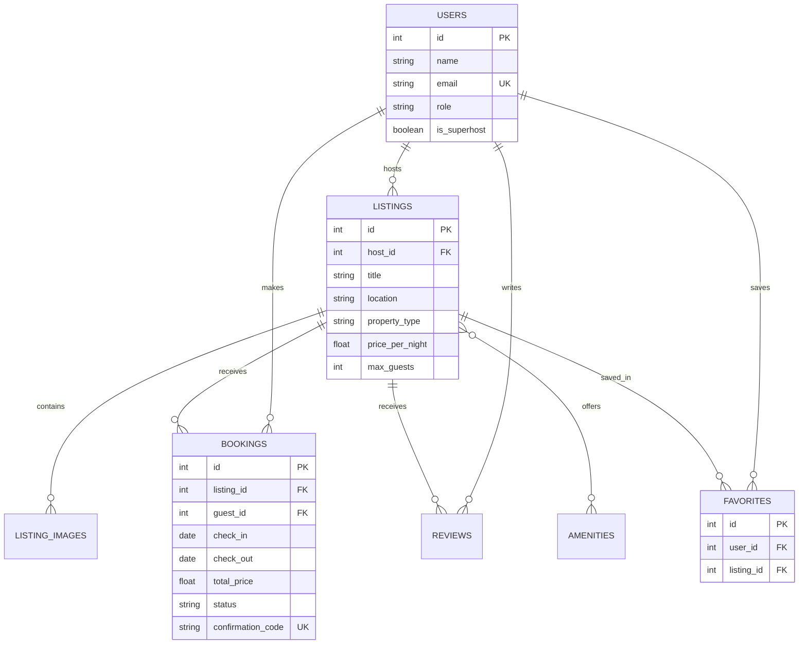

# Staybnb — Airbnb Full-Stack Assignment

A polished Airbnb-inspired marketplace built for the SDE Fullstack Assignment using **Next.js (TypeScript)**, **FastAPI**, **SQLAlchemy**, and **SQLite**.

The project includes the required browse/search/detail/booking workflows, persisted bookings with overlap protection, favorites, a guest trips dashboard, and complete host listing CRUD.

## Features

### Guest experience

- Airbnb-style responsive home/explore interface
- Seeded listing grid with photos, location, pricing, rating, and guest-favourite badges
- Search by destination, check-in, check-out, and guest count
- Filters for price range, property type, and amenities
- Server-side availability filtering
- Pagination
- Detailed property page with photo gallery, host information, amenities, map-style location panel, and reviews
- Date selection and live price breakdown
- Mocked card checkout and confirmation
- Persisted bookings with unique confirmation codes
- Date-overlap validation that blocks unavailable stays
- My Trips dashboard with booking cancellation
- Persisted wishlists/favorites

### Host experience

- Guest/Host role switcher for simplified authentication
- Host dashboard with listing and reservation views
- Booking-value and listing summary cards
- Create listings with photos, amenities, pricing, occupancy, and map coordinates
- Edit listings
- Delete listings
- View bookings associated with owned listings

### Engineering features

- Modular FastAPI routers
- Typed Next.js API client
- Pydantic validation
- Normalized relational schema and foreign keys
- SQLAlchemy relationships and cascade rules
- Automatic seed data on an empty database
- Automatic FastAPI/OpenAPI documentation
- Responsive desktop, tablet, and mobile layouts
- Toast notifications and loading/empty states
- Backend test for booking conflict prevention
- Docker Compose configuration
- Render blueprint for the API

## Tech stack

| Layer | Technology |
|---|---|
| Frontend | Next.js 16 App Router, React 19, TypeScript, CSS, Lucide icons |
| Backend | Python, FastAPI, Uvicorn, Pydantic |
| ORM | SQLAlchemy 2 |
| Database | SQLite |
| Deployment | Vercel for frontend; Render or Railway for backend |
| Testing | Pytest and FastAPI TestClient |

## Repository structure

```text
staybnb-fullstack/
├── frontend/
│   ├── app/
│   │   ├── page.tsx                    # Explore/search page
│   │   ├── listings/[id]/page.tsx     # Listing details and booking
│   │   ├── trips/page.tsx             # Guest bookings
│   │   ├── favorites/page.tsx         # Wishlist
│   │   └── host/                       # Host dashboard and CRUD pages
│   ├── components/                     # Reusable UI components
│   ├── lib/                            # API client, types, constants, formatting
│   └── app/globals.css                 # Complete responsive styling
├── backend/
│   ├── app/
│   │   ├── main.py                     # FastAPI application
│   │   ├── db.py                       # Engine and database session
│   │   ├── models.py                   # SQLAlchemy database models
│   │   ├── schemas.py                  # Pydantic request/response schemas
│   │   ├── serializers.py              # API response mapping
│   │   ├── seed.py                     # Seed users/listings/reviews/bookings
│   │   └── routers/                    # Listings, bookings, favorites, users, host
│   └── tests/test_api.py               # API and overlap test
├── docker-compose.yml
├── render.yaml
├── INTERVIEW_GUIDE.md
└── SUBMISSION.md
```

## Database design

The schema is normalized instead of storing all listing data inside one JSON field.



Important constraints include:

- Unique email per user
- Unique favorite per `(user_id, listing_id)`
- Positive listing price and guest capacity
- `check_out > check_in`
- Foreign-key cascade behavior for dependent data

## Booking availability logic

A requested date range conflicts with an existing confirmed booking when:

```text
existing.check_in < requested.check_out
AND
existing.check_out > requested.check_in
```

The backend performs this check before creating a booking and returns HTTP `409 Conflict` when dates overlap. The backend also calculates all totals itself, so the browser cannot manipulate the final charge.

## Local setup

### Prerequisites

- Node.js 20 or newer; Node.js 22 recommended
- npm
- Python 3.11 or newer; Python 3.12 recommended

### Option A: one-command startup on macOS/Linux

From the repository root:

```bash
chmod +x run_local.sh
./run_local.sh
```

Open:

- Frontend: `http://localhost:3000`
- Backend: `http://localhost:8000`
- Interactive API documentation: `http://localhost:8000/docs`

### Option B: run each service manually

#### 1. Start the backend

```bash
cd backend
python3 -m venv .venv
source .venv/bin/activate       # Windows PowerShell: .venv\Scripts\Activate.ps1
pip install -r requirements.txt
cp .env.example .env            # Windows: copy .env.example .env
uvicorn app.main:app --reload --port 8000
```

The SQLite database is created automatically as `backend/airbnb.db`. Seed data is inserted only when the user table is empty.

#### 2. Start the frontend in a second terminal

```bash
cd frontend
npm install
cp .env.example .env.local      # Windows: copy .env.example .env.local
npm run dev
```

The local frontend environment should contain:

```env
NEXT_PUBLIC_API_URL=http://localhost:8000/api
```

### Option C: Docker Compose

```bash
docker compose up --build
```

This starts the frontend on port `3000`, the backend on port `8000`, and persists SQLite data in a Docker volume.

## Demo identities

Authentication is simplified as permitted by the assignment.

| Mode | Seeded user | Database ID |
|---|---|---|
| Guest | Sonu Guest | 1 |
| Host | Maya Kapoor | 2 |

Use the Guest/Host switch in the header. In a production version, the client would never choose its database user ID; the backend would derive it from a secure authenticated session.

## Useful commands

### Frontend

```bash
cd frontend
npm run dev
npm run lint
npm run build
npm start
```

### Backend

```bash
cd backend
uvicorn app.main:app --reload
pytest -q
```

To reset all seeded data locally:

```bash
cd backend
rm airbnb.db                     # Windows PowerShell: Remove-Item airbnb.db
uvicorn app.main:app --reload
```

## API overview

Base path: `/api`

### Users

| Method | Endpoint | Purpose |
|---|---|---|
| GET | `/users` | List seeded demo users |
| GET | `/users/{user_id}` | Get a user |

### Listings

| Method | Endpoint | Purpose |
|---|---|---|
| GET | `/listings` | Search, filter, availability-check, and paginate listings |
| GET | `/listings/{listing_id}` | Listing details |
| GET | `/listings/{listing_id}/availability` | Confirmed unavailable date ranges |
| POST | `/listings` | Host creates a listing |
| PUT | `/listings/{listing_id}?host_id=2` | Host edits a listing |
| DELETE | `/listings/{listing_id}?host_id=2` | Host deletes a listing |

Supported listing query parameters include:

```text
location, check_in, check_out, guests,
min_price, max_price, property_type,
amenities, page, page_size
```

Multiple amenities are sent as repeated query parameters:

```text
/api/listings?amenities=WiFi&amenities=Pool
```

### Bookings

| Method | Endpoint | Purpose |
|---|---|---|
| POST | `/bookings` | Validate and create a booking |
| GET | `/bookings/user/{user_id}` | My Trips |
| GET | `/bookings/{booking_id}` | Booking details |
| DELETE | `/bookings/{booking_id}?user_id=1` | Cancel a future booking |

### Favorites

| Method | Endpoint | Purpose |
|---|---|---|
| GET | `/favorites/{user_id}` | List saved stays |
| POST | `/favorites` | Save a stay |
| DELETE | `/favorites/{user_id}/{listing_id}` | Remove a saved stay |

### Host dashboard

| Method | Endpoint | Purpose |
|---|---|---|
| GET | `/host/{host_id}/listings` | Host-owned listings |
| GET | `/host/{host_id}/bookings` | Reservations for host-owned listings |

## Deployment

### 1. Push to GitHub

Create an empty public repository, then run from this project root:

```bash
git init
git add .
git commit -m "Build Staybnb full-stack Airbnb assignment"
git branch -M main
git remote add origin https://github.com/YOUR_USERNAME/staybnb-fullstack.git
git push -u origin main
```

Do not commit `.env`, `.env.local`, `node_modules`, `.next`, virtual environments, or local database files.

### 2. Deploy the backend on Render

The included `render.yaml` describes a Python service and a persistent disk.

1. In Render, create a Blueprint from the GitHub repository, or create a Web Service manually.
2. Root directory: `backend`
3. Build command: `pip install -r requirements.txt`
4. Start command: `uvicorn app.main:app --host 0.0.0.0 --port $PORT`
5. Health check: `/health`
6. Set `DATABASE_URL` to a persistent disk location such as `sqlite:////var/data/airbnb.db`.
7. Set `FRONTEND_ORIGINS` after the Vercel URL is known, for example `https://your-project.vercel.app`.

A persistent disk is important because a normal ephemeral filesystem can reset SQLite after a redeploy or restart. Railway with a mounted volume is another suitable option.

### 3. Deploy the frontend on Vercel

1. Import the same GitHub repository into Vercel.
2. Set the project Root Directory to `frontend`.
3. Framework preset: Next.js.
4. Add this environment variable:

```env
NEXT_PUBLIC_API_URL=https://YOUR-RENDER-SERVICE.onrender.com/api
```

5. Deploy.
6. Copy the final Vercel domain into the backend's `FRONTEND_ORIGINS`, then redeploy the backend.

### 4. Final checks before submission

- Open the public frontend in an incognito window.
- Search and filter listings.
- Open a listing and choose future dates.
- Complete the mocked checkout.
- Confirm the booking appears in My Trips.
- Try the same dates again and verify they are rejected.
- Save and remove a wishlist item.
- Switch to Host.
- Create, edit, and delete a test listing.
- Confirm the GitHub repository is public.
- Confirm the README renders correctly.

## Assumptions and mocked parts

- Payment details are placeholders and no payment provider is contacted.
- Authentication is represented by a role switcher and seeded users.
- Public Unsplash image URLs are used instead of cloud uploads.
- The map is a designed static visualization rather than a live map API.
- Messaging, identity verification, and live pricing pins are out of scope.
- Fees and taxes are deterministic demo percentages, not real Airbnb charges.

## Testing status

The included project was checked with:

```bash
cd backend && pytest -q
cd frontend && npm run lint
cd frontend && npm run build
```

The backend test verifies health, successful booking creation, and rejection of an overlapping booking.

## Evaluation preparation

Read `INTERVIEW_GUIDE.md` before the evaluation. Be prepared to explain:

- The interval-overlap query
- Why the backend recalculates price
- The relational schema and many-to-many relationships
- Why simplified authentication is acceptable only for this assignment
- How SQLite data is persisted during deployment
- How frontend pages call the typed API client
- What you would change for production scale

## Submission text

Open `SUBMISSION.md` for copy-ready form entries and important guidance about the original-work declaration.
